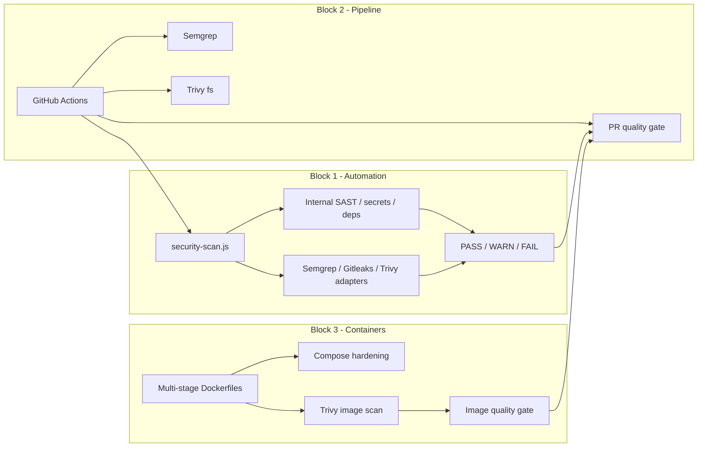
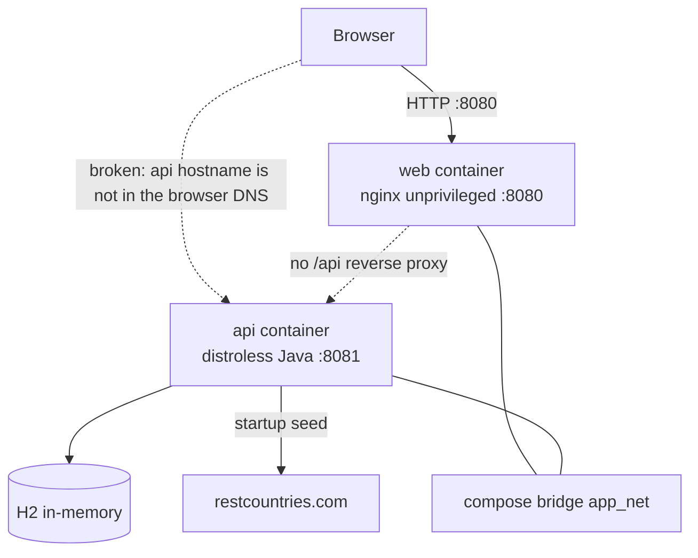
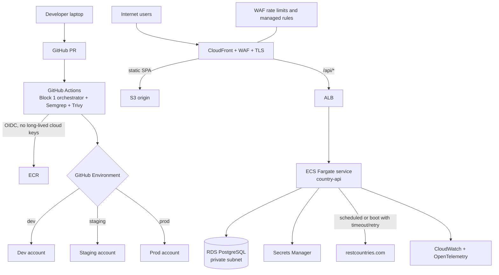
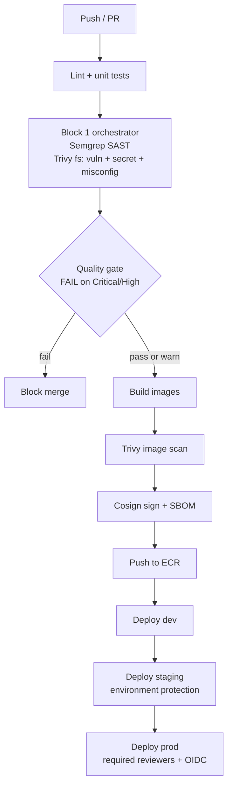
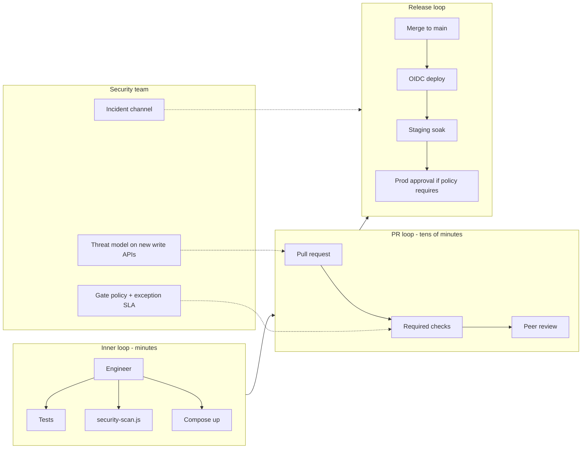
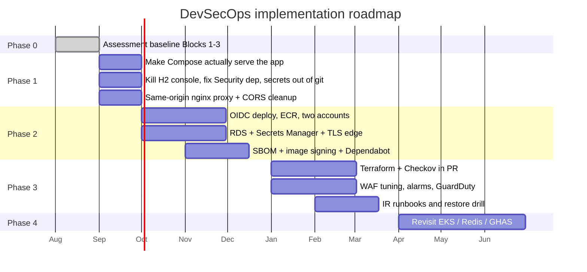

# Block 6 — DevSecOps Architecture Design

**System:** Country Flags web app + Country API  
**Audience:** Growing product organization (small engineering team today, 2–3 teams later)  
**Timebox intent:** Strategic design grounded in the provided application and Blocks 1–3. Not a production build.

This document is the primary architecture record. It answers four questions:

1. What do we have today, including the security gaps that matter?
2. What should the target architecture look like?
3. Where does security sit in the delivery and runtime paths?
4. What do we build first, what do we defer, and why?

Related diagrams:

- [Current state](architecture/diagrams/block-6-current-state.md)
- [Target runtime](architecture/diagrams/block-6-target-runtime.md)
- [SDLC security controls](architecture/diagrams/block-6-sdlc-security-controls.md)
- [Trust boundaries](architecture/diagrams/block-6-trust-boundaries.md)
- [Implementation roadmap](architecture/diagrams/block-6-implementation-roadmap.md)

---

## 1. Design principles

These constraints keep the design honest for a growing team rather than a FAANG platform org.

| Principle | What it means here |
|---|---|
| **Secure by default path** | The merge/deploy path already has quality gates. Target design extends that path instead of adding a parallel “security process.” |
| **Same-origin for browsers** | The SPA must not call an internal Docker hostname. Edge / reverse proxy is a security control, not just a networking nicety. |
| **Least privilege at every layer** | Continue what Block 3 started: non-root, dropped caps, read-only FS, short-lived cloud credentials. |
| **Operate with a small team** | Prefer managed services until a dedicated platform team exists. Kubernetes is a later option, not the starting point. |
| **Public data is still an attack surface** | Country catalog data is not secret. Admin surfaces, supply chain, availability, and abuse still are. |
| **Measure before multiplying tools** | Keep Semgrep + Trivy + the internal orchestrator. Add tools only when they close a named gap. |

---

## 2. Current-state analysis

### 2.1 What the provided application actually is

Two codebases, one user journey:

| Layer | Implementation | Runtime today |
|---|---|---|
| Frontend | React 18 SPA (`country-flags-app-main`), Create React App, Axios | nginx unprivileged on port 8080 |
| Backend | Spring Boot 3.4.3 (`country-service-main`), Java 17, JPA | Distroless Java, port 8081 |
| Data | H2 in-memory (`jdbc:h2:mem:countriesdb`) | Process-local, lost on restart |
| Seed data | `DataLoader` calls `https://restcountries.com/v3.1/all` at startup | External network dependency |
| Local deploy | `infrastructure/docker-compose.yml` | Single-host, no TLS |

The API is read-only:

- `GET /api/countries`
- `GET /api/countries/{countryName}`

Swagger UI is enabled. There is no authentication, no rate limiting, and no reverse proxy from the frontend container to the API.

### 2.2 What Blocks 1–3 already put in place

This is the foundation the target architecture should reuse, not replace.

Strengths to keep:

- One decision signal (`fail` / `warn` / `pass`) instead of scanner sprawl.
- Internal scanners still work if CI tools are missing.
- Images are already multi-stage, non-root, capability-dropped, and read-only.
- Distroless API runtime and nginx-unprivileged frontend are the right shape.

### 2.3 Gaps that will bite in production

These are the findings to address first. They are specific to this repo, not generic DevSecOps slogans.

| ID | Finding | Why it matters | Severity if we shipped Compose as-is |
|---|---|---|---|
| G1 | Browser cannot reach the API in Compose. nginx does not proxy `/api`. CSP `connect-src` includes `http://api:8081`, which only exists on the Docker network. | The “secure deployment” does not actually serve the user journey. | High (availability / design defect) |
| G2 | CORS allowlist is `http://localhost:3000` while containers serve the SPA on `8080`. | Even if the API is exposed, the browser origin will not match. | High |
| G3 | H2 console enabled, credentials in `application.properties` (`sa` / `password`). | Classic foothold if the API port is reachable. | High |
| G4 | `spring-boot-starter-security` is pinned to **2.7.0** on Boot **3.4.3**, and there is no `SecurityFilterChain`. | Version skew (javax vs jakarta). Either unused or actively unsafe. Security theater without a config. | High |
| G5 | Swagger UI and OpenAPI are public. | Fine in local dev; in prod it expands reconnaissance. | Medium |
| G6 | Startup depends on restcountries.com with a default `RestTemplate` (no timeouts, no retry, no circuit breaker). | Third-party outage or slow response blocks boot. SSRF/timeout risk later if URL becomes configurable. | Medium |
| G7 | No TLS, no secret store, no environment split. | Compose is a laptop topology, not a growing-org topology. | High (for any shared environment) |
| G8 | Frontend API URL is baked in at **image build** (`REACT_APP_API_URL`). | One image cannot move across `dev` / `staging` / `prod` without rebuild. | Medium |
| G9 | CRA + Axios `0.27.2` + `react-scripts` 5. Supply chain and CVE load on a legacy frontend toolchain. | Container scans will keep failing or warning as transitive CVEs accumulate. | Medium |
| G10 | No observability, no WAF, no abuse controls on a public GET API. | Scraping, request floods, and silent failures. | Medium |

Blocks 4 and 5 were intentionally skipped in the 3-hour assessment. The architecture still accounts for them as later phases: IaC/policy (Block 4) and detection/response (Block 5). Skipping them in the timebox is a sequencing choice, not a claim that they are unnecessary.

### 2.4 Current runtime (as built)

What is already good at this layer: `read_only`, `cap_drop: ALL`, `no-new-privileges`, tmpfs for writable paths, healthcheck on the frontend, non-root UIDs.

What is not: trust boundary between browser and API, TLS, identity of the deployment environment, and data durability.

---

## 3. Target architecture

### 3.1 Target shape for a growing organization

Keep two deployable units. Change how they are reached, configured, observed, and promoted.

### 3.2 Component decisions

#### Edge and same-origin

Put CloudFront in front of both the SPA and the API.

- SPA objects live in S3 (no long-running nginx process in production).
- `/api/*` is a second CloudFront behavior that forwards to an ALB.
- The browser only talks to `https://app.example.com`. CORS largely disappears.
- TLS is terminated at CloudFront. ALB uses HTTPS to the origin as well.

This directly fixes **G1**, **G2**, and **G8** (runtime config can live in CloudFront / env, not in a rebuild). For local and CI, nginx stays — but it must reverse-proxy `/api` to the backend. That is the first implementation item on the roadmap because it makes Block 3’s Compose topology actually work.

#### Compute: ECS Fargate, not EKS yet

| Option | When it wins | Cost / complexity |
|---|---|---|
| **ECS Fargate (chosen)** | 1–2 services, small team, no platform engineers | No control-plane fee. IAM, logs, and autoscaling are native. |
| Elastic Beanstalk / App Runner | Tiny internal tools | Too little control over networking and WAF placement. |
| **EKS** | 5+ services, custom scheduling, service mesh, multi-team platform | ~$73/month control plane plus node/Fargate cost **and** a Kubernetes skill tax. |

Revisit EKS when any two of these are true: more than four services, a platform team exists, or we need admission controllers / mesh-level mTLS as a standard.

The Block 3 image contract still applies on Fargate: distroless, non-root, read-only root filesystem, dropped Linux capabilities, no privileged mode.

#### Data: RDS PostgreSQL, not H2

H2 in-memory is a demo database. Target:

- RDS PostgreSQL, Multi-AZ in prod, single-AZ in non-prod.
- Encryption at rest (AWS-managed key first; CMK later if compliance requires it).
- No public accessibility. Security group only from the ECS task SG.
- Credentials from Secrets Manager, rotated, never in git.

Seed data: move `DataLoader` off the request path. A scheduled job or deploy hook pulls restcountries.com with explicit timeouts, retries, and a last-known-good cache so an upstream outage does not block API boot (**G6**).

#### Identity and access — do not over-authenticate public read data

The catalog is public reference data. Forcing Cognito login on `GET /api/countries` adds friction and cost without reducing a real confidentiality risk.

What we **do** lock down:

| Surface | Target control |
|---|---|
| H2 console | Removed. Never present outside local profiles. |
| Swagger / OpenAPI | Disabled in prod; allowed in dev/staging behind VPN or basic SSO. |
| Actuator (when added) | Internal listener only, or CloudFront path blocked. |
| Cloud / CI | GitHub OIDC → AWS IAM roles. No static `AWS_ACCESS_KEY_ID` in GitHub secrets. |
| Humans | AWS SSO / IAM Identity Center. No shared root keys. |
| Future write APIs (favorites, notes) | Add Cognito (or equivalent) **then**, with a public read tier still unauthenticated. |

Abuse controls for the public GET API: WAF rate limiting, CloudFront caching of `GET /api/countries`, and request-size limits. That is the right control for a scrape/DDoS-shaped threat.

#### Secrets and configuration

| Secret class | Store | Injection |
|---|---|---|
| DB credentials | AWS Secrets Manager | ECS task definition reference |
| Third-party API keys (if restcountries ever requires them) | Secrets Manager | Same |
| Non-secret env (log level, feature flags) | SSM Parameter Store or ECS env | Task definition |
| GitHub → AWS | OIDC trust policy | No stored cloud keys |
| Container registry | ECR + repository policies | CI role |

`application.properties` in git should contain **no** passwords. Spring `dev` profile may use H2 locally; `prod` profile uses env/Secrets Manager.

Frontend: stop baking environment URLs into the image. Serve a same-origin `/api` and, if needed, a generated `config.js` at deploy time — not `REACT_APP_*` at `docker build`.

#### CI/CD as the security control plane

GitHub remains the system of record (assessment requirement and the right choice for this team size).

Changes versus today’s workflows:

- Combine pipeline + container scans into one promotion graph so an image that failed Trivy cannot be deployed.
- GitHub Environments for `dev` / `staging` / `prod` with protection rules on prod.
- Produce a CycloneDX or SPDX SBOM at build (Trivy can emit this) and store it next to the image.
- Image signing (Cosign) in Phase 2 — cheap supply-chain control, high assurance value, low ops cost.
- `permissions: contents: read` stays. Deploy job gets `id-token: write` only.

### 3.3 Security integration points

Security is not a stage at the end. It is a set of gates on paths developers already use.

| Lifecycle point | Control | Owner | Fail behavior |
|---|---|---|---|
| **Inner loop (laptop)** | `security-scan.js` + Compose with `/api` proxy | Developer | Local fail; no ticket to security |
| **PR** | Semgrep + Trivy fs + internal orchestrator | GitHub Actions | Merge blocked on Critical/High |
| **Image build** | Distroless/unprivileged Dockerfiles + Trivy image | Platform / app team | Image not published |
| **Registry** | ECR immutable tags, scan on push | Platform | Mutable `latest` banned in prod |
| **Deploy** | OIDC, environment protection, least-privilege task role | Platform | Deploy job cannot use static keys |
| **Edge** | CloudFront TLS, WAF, caching, path allowlists | Platform | `/swagger`, `/h2-console` not routed |
| **Runtime** | Read-only FS, non-root, no privileged, SG/NACL | Platform | Task definition rejected if privileged |
| **Data** | Private RDS, encryption, secret rotation | Platform | No public DB SG rules |
| **Detect** | CloudWatch alarms, GuardDuty, VPC flow logs | Security (Phase 3) | Alert → on-call |
| **Respond** | Runbooks, image rollback, key rotation | Security + eng (Phase 3) | Time-boxed drill |

This is how Block 6 absorbs the skipped Block 4 (policy on deploy/IaC) and Block 5 (detect/respond) without pretending those 45-minute exercises were completed.

### 3.4 Scalability

The current app is a read-mostly catalog. Scale the bottleneck that actually exists.

| Layer | Current | Target | Scale lever |
|---|---|---|---|
| SPA | One nginx container | CloudFront + S3 | Edge cache; almost free to scale |
| `GET /api/countries` | Hits H2 every request | CloudFront cache + API with short TTL | Most traffic never reaches ECS |
| Detail lookup | Path parameter, in-memory | RDS + optional Redis later | Add Redis only after cache-hit metrics say so |
| ECS | One task | Autoscaling on CPU / ALB RPS | Fargate scale-out, min 2 in prod |
| Seed/sync | Blocking boot | Async job | API stays up if upstream is down |
| Team / services | One repo, two apps | Same repo until service #3 | Split only when ownership splits |

Do **not** introduce Kafka, service mesh, or per-endpoint microservices for a two-endpoint read API. That is complexity without a scaling problem.

Horizontal scale trigger: p95 latency on `/api/countries` above budget **and** CloudFront cache hit rate below ~80%. Until then, caching is the scalability control.

### 3.5 Team workflow

Goal: developers ship; security sets policy; neither waits on the other for default cases.

Rules that keep this fast:

- Default path is automated. Exceptions (accepted High CVE with no fix) are a GitHub issue with expiry, not a Slack DM.
- Security review is required when the threat model changes: new write endpoint, new third-party, new data class, new trust boundary.
- The existing `fail` / `warn` / `pass` language stays. Developers already learned it in Blocks 1–3.

---

## 4. Cost and complexity trade-offs

Monthly cost is order-of-magnitude for a small production of this app, us-east-1, modest traffic. Numbers are for conversation, not a quote.

| Choice | Approx. monthly | Complexity | Decision |
|---|---|---|---|
| Status quo: GitHub + laptop Compose | ~$0 | Low | Fine for the assessment; not a shared environment |
| **Target: CloudFront + S3 + ALB + ECS Fargate (0.25 vCPU) + RDS t4g.micro + WAF + Secrets Manager** | **~$90–180** | Medium | Chosen |
| Add ElastiCache Redis on day one | +$15–40 | Medium | Defer until cache metrics justify it |
| EKS instead of ECS | +$73 control plane + ops time | High | Defer |
| GitHub Advanced Security + Dependabot | $0–few $/active committer on Team | Low | Enable Dependabot now; GHAS if the org already pays for GitHub Team |
| Commercial SAST/SCA suite (Snyk/Checkmarx) | $ tens–hundreds per contributor | Medium | Not yet — Semgrep + Trivy already cover the PR gate |
| WAF | Included in the $90–180 band if rules are modest | Low | Keep; cheapest abuse control |
| Multi-account (dev/stg/prod) | Mostly IAM time, not dollars | Medium | Yes for prod isolation; start with two accounts (nonprod + prod) if three is too much |

**What this design refuses if asked to “just add it”:**

- Service mesh on two containers.
- Vault cluster when Secrets Manager + OIDC suffice.
- Full zero-trust overlay before basic TLS and SG hygiene.
- Replacing the working quality-gate model with a vendor dashboard that developers ignore.

**What I would spend money on first:** TLS + WAF + managed DB + OIDC. Those close G3/G7/G1-class issues. A prettier scanner does not.

---

## 5. Tool and approach justification

| Concern | Choice | Why this, not the alternative |
|---|---|---|
| Source + CI | GitHub + Actions | Required by the assessment; also the lowest-friction control plane for this team. |
| SAST | Semgrep | Fast, PR-native, works for JS and Java. CodeQL is a good add-on later, not a replacement. |
| Secrets in code | Gitleaks (orchestrator) + Trivy secret scanner + GitHub secret scanning | Defense in depth; Block 1 already filters obvious false positives. |
| Vulnerabilities / misconfig | Trivy | One tool for fs, image, and (later) IaC. Avoids four SCA vendors. |
| Aggregation | Existing `security-scan.js` + workflow gate | Unified schema and one signal. Do not make developers parse three UIs. |
| Containers | Distroless Java + nginx-unprivileged | Already implemented; stay the course. Alpine-with-shell is a step backward. |
| Orchestration | ECS Fargate | See §3.2. EKS when the platform team exists. |
| IaC (Phase 2) | Terraform + Checkov/Trivy config | Industry default, PR-reviewable, fits skipped Block 4 without Ansible + Terraform dual stack. |
| Edge | CloudFront + AWS WAF | SPA caching and API shielding in one place. nginx in prod would mean patching a web server we do not need. |
| Secrets | Secrets Manager + GitHub OIDC | Removes the most common CI breach (leaked access keys). |
| Observability | CloudWatch + OpenTelemetry traces | Enough for one API. Datadog/Grafana later if cardinality or SLO culture demands it. |
| Detection (Phase 3) | GuardDuty + Security Hub + CloudWatch alarms | Covers skipped Block 5 without a SIEM RFP in month one. |

---

## 6. Implementation roadmap

Priority is **risk reduction per week of small-team effort**, not completeness.

### Phase 0 — now (assessment)

Already delivered:

- Multi-scanner orchestrator with pass/warn/fail.
- GitHub Actions quality gates.
- Hardened images and Compose runtime flags.

### Phase 1 — first 30 days (unblocks everything else)

Must-fix before any shared environment.

1. **nginx reverse-proxy `/api` → `api:8081`** and set CSP `connect-src 'self'`. Fixes G1.
2. **CORS:** either drop CORS (same-origin) or allow the real origin, not only `:3000`. Fixes G2.
3. **Remove H2 console from non-local profiles; delete plaintext DB password from git.** Fixes G3.
4. **Align Spring Security with Boot 3 or remove the unused 2.7.0 starter.** Add an explicit `SecurityFilterChain` that permits `GET /api/countries/**` and denies the rest by default. Fixes G4.
5. **Disable Swagger in prod profile.** Fixes G5.
6. **Give `RestTemplate` timeouts; do not fail boot if restcountries.com is down.** Fixes G6.
7. **Keep serving Compose for local inner loop** — it is the developer workflow. Do not jump to cloud before the app topology is correct.

Exit criteria: `docker compose up` loads flags in a browser without extra host entries or exposed API ports.

### Phase 2 — days 30–90 (first real environment)

1. AWS nonprod + prod accounts, GitHub OIDC, ECR.
2. CloudFront + S3 (SPA) + ALB + ECS Fargate (API).
3. RDS PostgreSQL; Secrets Manager; no secrets in git.
4. Combined pipeline: test → SAST/secrets → build → image scan → sign → deploy.
5. Dependabot. SBOM attached to each release.
6. Basic dashboards: 5xx, p95, WAF blocked requests, ECS restarts.

Exit criteria: staging URL over HTTPS, prod deploy requires GitHub Environment approval, zero static AWS keys in GitHub.

### Phase 3 — days 90–180 (the skipped blocks, done properly)

This is Block 4 and Block 5 in production form.

**IaC / policy (Block 4):**

- Terraform for VPC, ECS, RDS, CloudFront, IAM, WAF.
- Checkov or Trivy config in the same PR quality gate.
- Sentinel/OPA only if a compliance customer demands it — not before Terraform is the source of truth.

**Incident response (Block 5):**

- GuardDuty + Security Hub.
- Alarm → Slack/PagerDuty for 5xx burn and WAF floods.
- Three runbooks: stolen GitHub OIDC role, vulnerable image in prod, upstream restcountries poisoning/outage.
- Quarterly restore drill from RDS snapshot.

Exit criteria: an engineer who did not write the system can deploy from Terraform and execute the rollback runbook.

### Phase 4 — 6–12 months (only with evidence)

- EKS if service count and platform staffing justify it.
- Redis if CloudFront + API caching is insufficient.
- Cognito when the first authenticated write API is scheduled — not before.
- Frontend toolchain migration off CRA when container CVE noise from `react-scripts` exceeds the migration cost (G9).

---

## 7. Threat model (STRIDE-lite)

Scoped to the **target** architecture. This is the threat discussion the design is built around.

| Threat | Example against this app | Mitigation |
|---|---|---|
| **Spoofing** | Fake GitHub workflow deploy to prod | OIDC bound to repo + environment; prod approval |
| **Tampering** | Poisoned npm/Maven dep or tagged image | Lockfiles, Trivy, immutable ECR tags, Cosign verify on deploy |
| **Repudiation** | “Who deployed the bad image?” | GitHub Environment logs + CloudTrail |
| **Information disclosure** | H2 console, Swagger, secrets in git, verbose 500s | Profile-based hardening; secrets manager; generic errors in prod |
| **Denial of service** | Flood `GET /api/countries` or block boot via restcountries.com | CloudFront cache, WAF rate limit, async seed, min 2 tasks |
| **Elevation of privilege** | Container escape, over-broad task role | Distroless/non-root/read-only/cap_drop; task role with RDS+SM only |

Out of scope until write APIs exist: user-to-user IDOR, session fixation, stored XSS in user content. Flag images are remote URLs (`img-src https:`); that is an intentional CSP relaxation and should stay documented.

---

## 8. Assumptions

- Growing organization means a handful of engineers now, not a 200-person platform group.
- Country data remains public and read-mostly for the next two phases.
- GitHub stays the SDLC system of record.
- AWS is acceptable as the first cloud. The pattern (edge + compute + managed SQL + OIDC) ports to Azure/GCP.
- Blocks 4 and 5 were skipped for time, not because IaC or IR are optional in the target state.
- Assessment success is demonstrated thinking and a credible roadmap, not a live AWS account.

---

## 9. Design summary

If time is short, this is the sequence:

1. **Current state is a demo topology with real security work already started** — scanners, gates, hardened images.
2. **The highest-priority defect is architectural, not a missing scanner:** the browser cannot safely and correctly reach the API (G1/G2).
3. **Target is same-origin HTTPS at the edge, Fargate + RDS, OIDC deploys, keep today’s quality-gate language.**
4. **We do not authenticate a public catalog; we do lock down admin surfaces and abuse.**
5. **EKS, Redis, Vault, and a SIEM are Phase 4 purchases, not architecture flex.**
6. **Skipped Block 4/5 become Phase 3: Terraform+Checkov and GuardDuty+runbooks.**

That is the design. The diagrams in `docs/architecture/diagrams/` are the visual versions of the same story.
