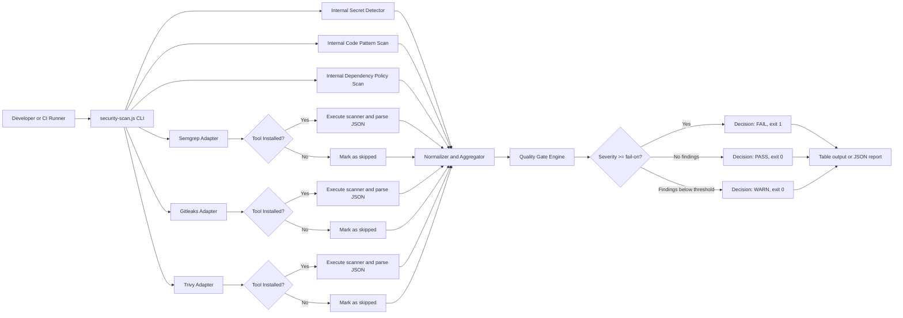

# Block 1 - Multi-Scanner Orchestrator Architecture

## Legend

- Internal scanners always run and provide baseline coverage.
- External scanners are optional and auto-detected.
- All findings are normalized into one unified schema.
- Quality gate produces a single decision signal for CI usage.

## Design Notes

- This design is resilient in constrained environments because it does not depend on external tools to function.
- The aggregated decision model simplifies pipeline integration in Block 2.
- Output supports both human-readable table format and machine-readable JSON.
