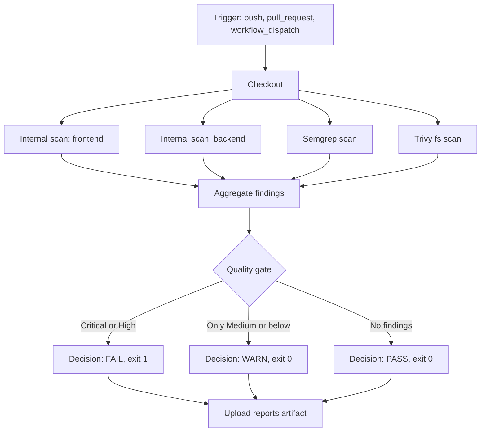

# Block 2 - Secure Pipeline Architecture

## Design intent

- Provide multiple security perspectives in one workflow run.
- Keep scanner outputs machine-readable to support objective gating.
- Publish a single decision signal for release control.
