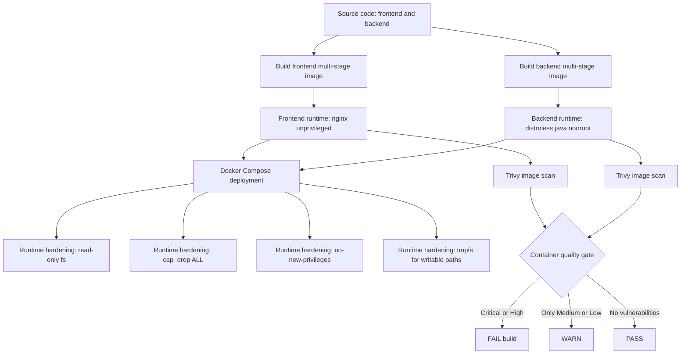

# Block 3 - Container Security Architecture

## Design intent

- Secure images by design using minimal non-root runtimes.
- Harden runtime with least privilege controls.
- Catch container vulnerabilities early with CI scanning and policy gate.
