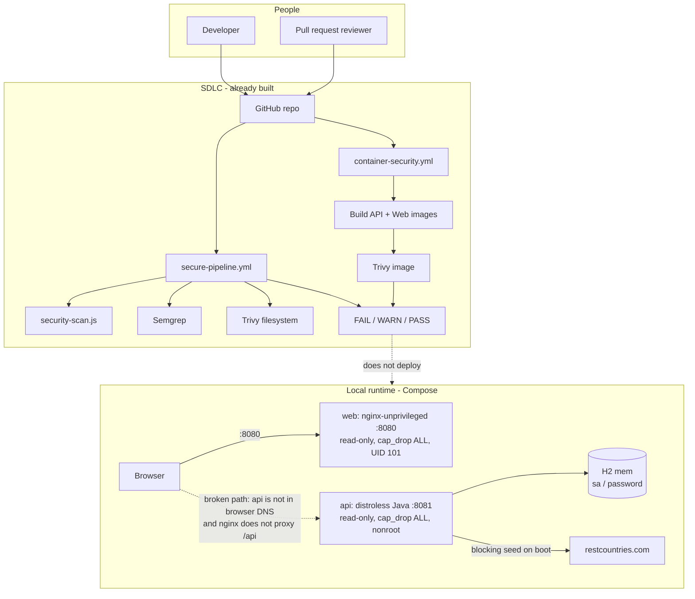

# Block 6 — Current State

As-built from the provided apps plus Blocks 1–3. This is a laptop topology with security gates, not a production environment.

## Legend

- Solid arrows are paths that work today.
- Dashed arrows are intended paths that do not work as designed.

## Design notes

- Blocks 1–3 already give a usable security signal. The architecture problem is runtime topology and environment, not “add more scanners.”
- Highest-priority defects: no `/api` reverse proxy, CORS origin mismatch (`:3000` vs `:8080`), H2 console + plaintext password, Spring Security 2.7.0 on Boot 3.4.3 with no filter chain.
- Compose hardening (`read_only`, `no-new-privileges`, tmpfs) should survive into the target runtime as ECS task constraints.
