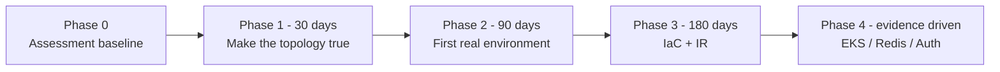
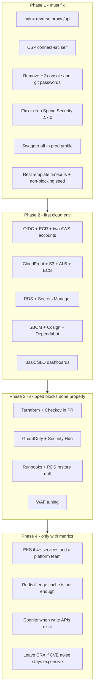

# Block 6 — Implementation Priority Roadmap

Risk reduction per week of small-team effort. Phases are sequential on purpose: do not buy EKS before the browser can reach `/api`.

## Priority table

| Order | Item | Closes | Effort |
|---|---|---|---|
| 1 | Same-origin `/api` proxy + CSP | G1, G2 | Small |
| 2 | H2 console off, secrets out of git | G3 | Small |
| 3 | Spring Security aligned or removed; default-deny except GET catalog | G4 | Small |
| 4 | Swagger/OpenAPI profile-gated | G5 | Small |
| 5 | Timeouts and async seed | G6 | Small |
| 6 | OIDC + HTTPS edge + RDS | G7, G8 | Medium |
| 7 | Terraform + policy scan | Skipped Block 4 | Medium |
| 8 | Detection, runbooks, restore drill | Skipped Block 5 | Medium |
| 9 | EKS / Redis / user auth | Scale or product evidence | Large |

## Design notes

- Phase 1 is still Compose. Shipping broken local topology to AWS just reproduces G1 in the cloud.
- Phase 3 is where IaC security and incident response belong. Skipping those assessment blocks was a timebox choice; they are not optional in the target state.
- Phase 4 items are explicitly **not** promised. They need a metric or a product change as a trigger.
