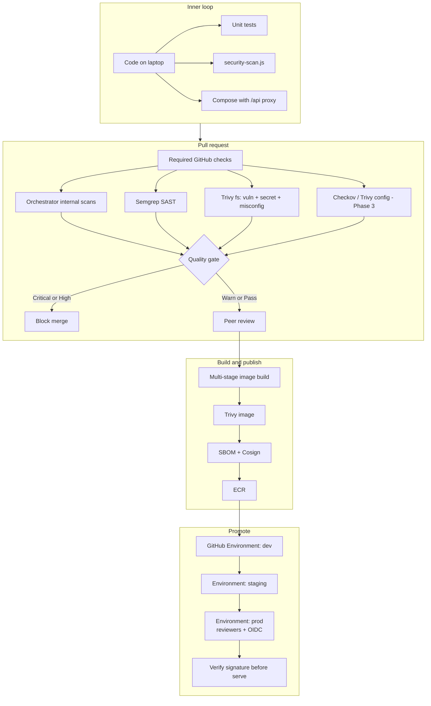

# Block 6 — SDLC Security Controls

Where security sits on the path developers already use. Extends Blocks 1–3; does not replace them.

## Gate policy (unchanged language from Blocks 1–3)

| Decision | Meaning | Pipeline result |
|---|---|---|
| FAIL | Critical or High present | Non-zero exit, merge blocked |
| WARN | Only Medium/Low/Info | Merge allowed, summary flags debt |
| PASS | Zero findings | Merge allowed |

## Design notes

- Developers keep one mental model: fail / warn / pass.
- New tools (Checkov, Cosign) plug into the same aggregator story instead of new dashboards.
- Prod deploy permission is `id-token: write` on that job only. Default `contents: read` stays.
- Exceptions to the gate (unfixed High CVE) expire and are tracked in GitHub, not in Slack.
