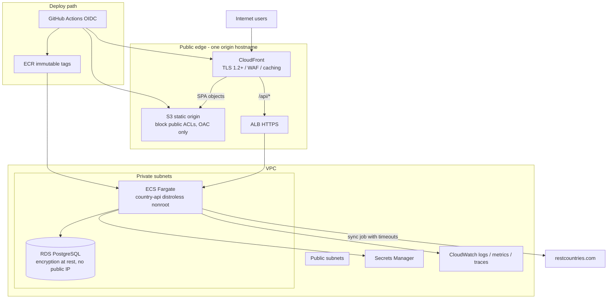

# Block 6 — Target Runtime Architecture

Production-shaped runtime for a growing team. Two deployable units, one public origin.

## Legend

- Browser never learns about ECS, RDS, or Docker network names.
- `/api` is same-origin. CORS is not the primary control.
- Secrets never enter the image or the git repo.

## Design notes

- CloudFront + S3 replaces long-running nginx in **production**. nginx remains for **local Compose** with a reverse proxy added.
- ECS Fargate is the default compute. EKS is a Phase 4 revisit, not the opening move.
- Cache `GET /api/countries` at the edge. That is the scalability control for a read-mostly catalog.
- Min 2 Fargate tasks in prod for availability during deploys and host recycling.
