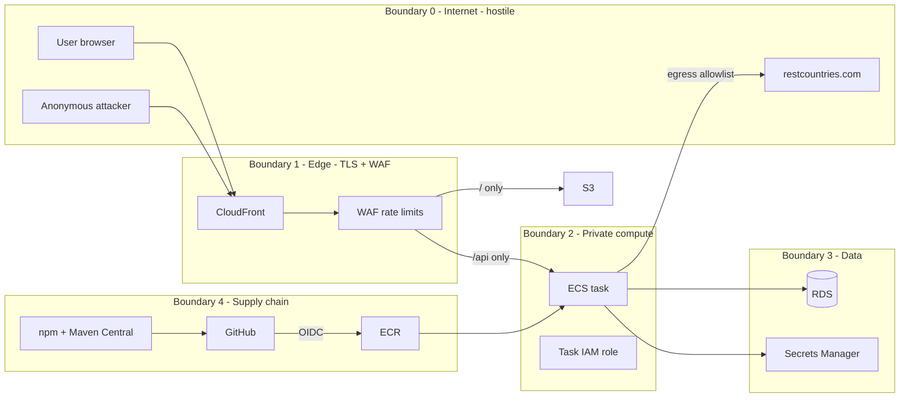

# Block 6 — Trust Boundaries

What can talk to what, and what we assume is hostile.

## Boundary rules

| Boundary | Allow | Deny |
|---|---|---|
| 0 → 1 | HTTPS to CloudFront | Direct hits to ALB / ECS / RDS public IPs (there should be none) |
| 1 → 2 | `/api/*` to ALB | `/h2-console`, `/swagger-ui`, actuator |
| 2 → 3 | Task SG to RDS SG on 5432; task role to specific secret ARNs | Any other data store or secret |
| 2 → 0 | Egress to restcountries.com (and AWS APIs) | Arbitrary egress. Tighten with VPC endpoints + egress SG when the team can operate it |
| 4 → 2 | Signed images from this repo’s ECR | `latest` tags, images from developer laptops |

## STRIDE mapping

- **Spoofing:** OIDC audience/subject conditions; no static AWS keys.
- **Tampering:** immutable tags + Cosign verify.
- **Repudiation:** CloudTrail + GitHub Environment logs.
- **Info disclosure:** no admin surfaces at the edge; secrets not in git.
- **DoS:** WAF + CloudFront cache + min 2 tasks.
- **EoP:** non-root distroless, read-only FS, dropped caps, narrow task role.

## Design notes

- Public catalog data is not a confidentiality asset. Availability, integrity of seed data, and admin-surface exposure are.
- When the first write API appears, add Boundary 5: authenticated user identity (Cognito) in front of mutating routes only.
